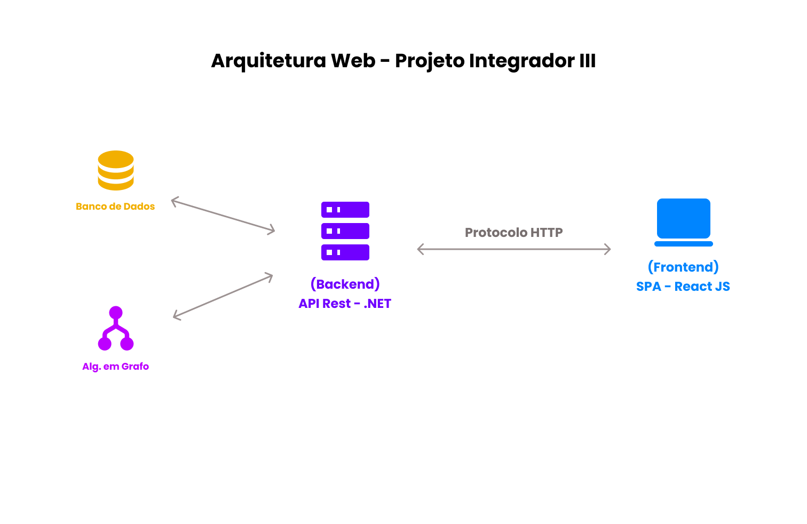

<h2>Marcos do Projeto</h2>

<b>Marco I:</b> No Marco I (20 / 04), os grupos obrigatoriamente apresentarão como as tarefas devem ser divididas entre
os membros. Metodologia de Desenvolvimento.

<b>Marco II:</b> Art. 10º – No Marco II (11 / 05), os grupos obrigatoriamente apresentarão o andamento das atividades do seu
projeto. Padrão arquitetural de desenvolvimento web.

<b>Marco III:</b> Art. 11º – No Marco III (22 / 06), os grupos obrigatoriamente apresentarão o andamento das atividades do seu
projeto. Algoritmo em Grafo.

<b>Marco IV:</b> Art. 12º – No Marco IV (13 / 07), os grupos obrigatoriamente apresentarão o andamento das atividades do seu
projeto.Funcionalidades implementadas.

<b>OBS:</b> §1º Se alguma das disciplinas envolvidas no projeto estiver com o conteúdo atrasado, as
funcionalidades relacionadas a disciplina poderão ser removidas ou reduzidas, ao critério
do professor.

<b>OBS:</b> Art. 13º – Os marcos devem ser apresentados pelo grupo nas datas estipuladas.

<h2>Marco II -  Padrão Arquitetural de Desenvolvimento Web</h2>

    

